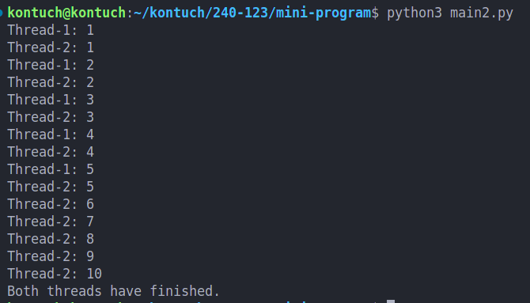

# mini-program
mini progame create by python for learning thread

## ผู้จัดทำ นายกรธัช สุขสวัสดิ์

## Thread คืออะไร ?

Thread คือ ส่วนย่อยของโปรแกรมที่สามารถทำงานหลายอย่างพร้อมกันได้ โดยไม่ต้องรอให้แต่ละงานเสร็จทีละขั้นตอน เหมือนมีผู้ช่วยหลายคนทำงานไปพร้อมกันในโปรเซสเดียว ทำให้โปรแกรมทำงานได้เร็วขึ้นในบางกรณี เช่น การโหลดข้อมูลจากอินเทอร์เน็ตขณะทำงานอย่างอื่นไปด้วย

## การทำงานของ code
```
thread1 = threading.Thread(target=print_numbers, args=("Thread-1",))
thread2 = threading.Thread(target=print_10_numbers, args=("Thread-2",))

thread1.start()
thread2.start()
```
เป็นการสร้างและเริ่มทำงานของ 2 threads ช่วยให้codeสามารถทำงานหลายอย่างพร้อมกันได้

```
thread1.join()
thread2.join()
```
คำสั่ง thread.join() ทำให้โปรแกรมหลักต้องรอจนกว่า thread1 และ thread2 จะทำงานเสร็จ

## ผลการ run code



thread1 จะพิมพ์ตัวเลข 1-5
thread2 จะพิมพ์ตัวเลข 1-10
ทั้งสอง threads จะทำงานพร้อมกัน มีข้อความจากทั้งสอง threads ปะปนกัน
เมื่อทุก thread ทำงานเสร็จ โปรแกรมจะแสดง "Both threads have finished."

## สรุปข้อดีของการใช้ Threads

- ทำให้สามารถรันงานที่ต้องรอ (เช่น sleep, I/O) แบบขนานได้
- ลดเวลาในการรอให้ฟังก์ชันทำงานเสร็จ
- เหมาะสำหรับงานที่เป็น I/O-bound เช่น ดาวน์โหลดไฟล์, อ่าน/เขียนไฟล์, ทำงานกับ API